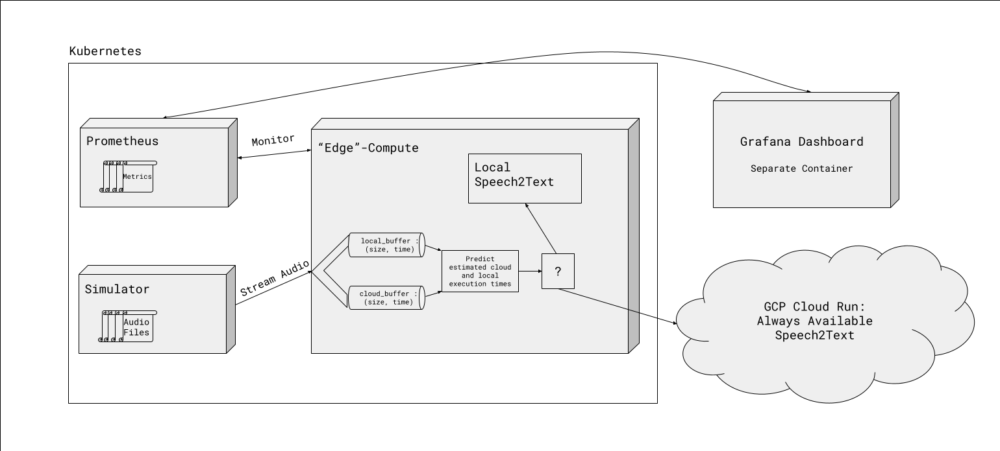

# Predictive Edge Offloading Project

## Overview

This is a project that evaluates the feasibility of implementing a dynamic predictive edge offloading algorithm using Kubernetes and GCP. The core idea is to predict the latency and overall execution time of tasks both locally and in the cloud, and then select the optimal execution choice, that is edge or cloud, to reduce total system latency and improve reliability.

**Key Goals:**

- Evaluate the performance increase and consistency of decision making by the model of a dynamic prediction offloading algorithm.
- Understand how Cloud design choices affect the performance and behavior.

## Research Question

The main research question driving this project:

> **How does a dynamic, ML-based prediction offloading algorithm affect the performance and consistency of offloading choice for an edge/cloud system?**

## Running Locally

First, make sure the following requirements are installed locally.

### Requirements

- **Docker**:  
  Make sure that you have [Docker](https://docs.docker.com/get-docker/) installed and running on your system.

- **Minikube**:
  Install [Minikube](https://minikube.sigs.k8s.io/docs/start/?arch=%2Fmacos%2Farm64%2Fstable%2Fbinary+download).

- **Kubectl**:
  Intall [Kubectl](https://kubernetes.io/docs/tasks/tools/install-kubectl-macos/)

First, start `minikube` locally with:

```
minikube start
```

Then, in another terminal window, run the Kubernetes pods with the following:

```
kubectl apply -f simulator.yaml
kubectl apply -f prometheus-deployment.yaml
kubectl apply -f edge-compute.yaml
```

In order for the simulator to reach the audiofiles in `/audio`, go back to the terminal where minikube was started and run the following to mount the audio folder into the minikube VM:

```
minikube mount PATH/TO/REPO/project/audio:/audio
```

Even though the Grafana dashboard connection is not solved yet, Grafana can be run locally using the following

```
docker run -d -p 3000:3000 --name=grafana grafana/grafana
```

The prometheus ports then have to be forwarded to the local machine using

```
kc port-forward svc/prometheus 9090:9090
```

Now everything should be running. The logs of the `edge-compute` pods give the situational overview.

Currently, the URL of the cloud service is written in the kubernetes deployment file. Will remove this once the project has been graded.

If one runs this without the real cloud application, the `cloud-compute.yaml` can also be deployed and the `edge-compute` can be pointed to that pod instead of the real cloud server.

## Details

### Tasks and Implementation Approach

- **Tasks:**
  - **NLP Speech-to-Text**: Highly variable input length, leading to unpredictable compute times.
- **Implementation:**
  1. Dynamically train a lightweight ML regression model based on recent tasks.
  2. Use this model to predict local execution time (t_l) vs. cloud execution time (t_c).
  3. Make a decision on-the-fly: execute locally or offload to cloud depending on which option yields lower latency.

## Architecture and Technologies

- **Edge Environment:**
  - Kubernetes pods simulate constrained compute environments.
  - A local buffer stores metadata (task size, completion times) for the last N tasks.
- **Cloud Environment:**

  - Cloud compute (e.g., GCP Cloud Run) as an always-available speech-to-text service.
  - Potentially serverless for easy scaling, or a fixed server for stable performance metrics.

- **Monitoring & Metrics:**

  - Prometheus for metrics collection (e.g., latency, queue times).
  - Grafana for visualization and analysis of performance trends.

The diagram below shows a high level picture of the architecture.

The following is a lost of the technologies used:

- Kubernetes
- Minikube
- Docker
- Python
- Flask
- scikit-learn
- OpenAI Whisper
- Prometheus
- Grafana

## Algorithm Pseudocode

Below is a rough pseudocode snippet representing the decision logic:

```pseudo
Init buffers B_l (local) and B_c (cloud)

For each incoming audio file (task):
    # Fit/Update model based on last N tasks
    fit m_l and m_c (models predicting t_l and t_c)

    pred_l, pred_c <- predict incoming task's time locally and in cloud

    If B_l size == B_c size && B_l == N:
        if pred_l < pred_c:
            execute locally
            add new record to B_l
        else:
            execute in cloud
            add new record to B_c
    else:
        # If buffer sizes differ, or N warmup runs have not been run yet
        Execute both (for training purpose)
        add record to both B_l and B_c
```
